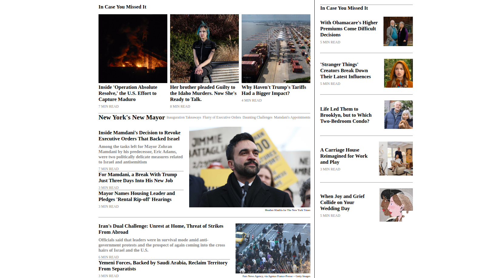
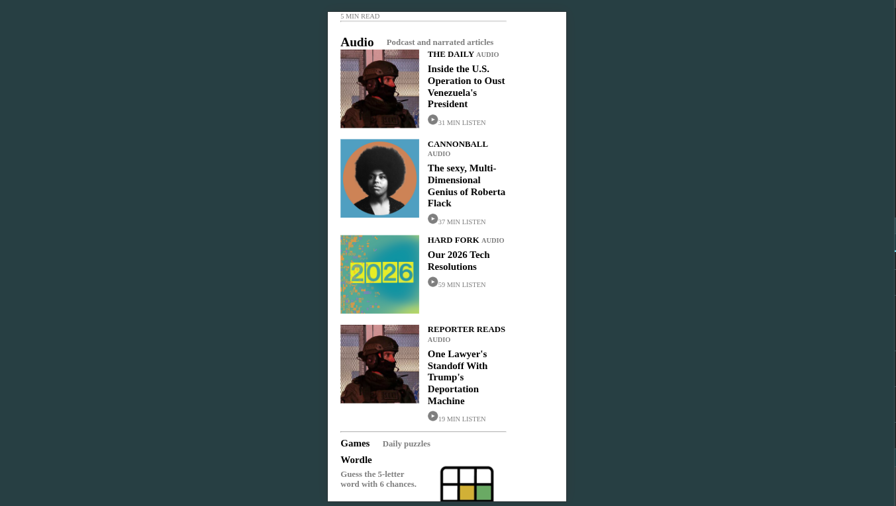

# New York Times Replica


## Overview
This is a recreation of a New York Times homepage built using *HTML*, *CSS* and responsive layout design. The project mostly focuses on the page structure (section, div, article, img, video) and is design to work across different devices(mobile, tablet and desktop).

### Project Structure
The project follows the frontend structure below;

|
|--- .github/
|  |--- workflows/
|    |--- linters.yml # Contains the linters code for checking code errors
|
|--- index.html # The main HTML file containing the page structure
|
|--- styles/
|  |--- style.css # All CSS styling
|
|--- assets  # Contains the logos, images, videos
|
|---README.md # Project overview and documentation
|


### TecH Stack
- HTML
- CSS
- Flexbox and CSS Grid
- Media Queries
- VS Code/ Browser


### How to run this project
1) Clone the repository [here](https://github.com/AsohLove/New-York-Times-Replica.git)
2) open index.html in a browser
3) YOu can now view a New York Times homepage replica


**Code snippet**

```HTML
    <div class="nav-links">
        <select name="us" id="us" class="link-lists">
            <option value="us">U.S.</option>
        </select>
        <select name="world" id="world" class="link-lists">
            <option value="world">World</option>
        </select>
        <select name="Business" id="business" class="link-lists">
            <option value="business">Business</option>
        </select>
        <select name="arts" id="arts" class="link-lists">
            <option value="arts">Arts</option>
        </select>
        <select name="lifestyle" id="life" class="link-lists">
            <option value="life">Lifestyle</option>
        </select>
        <select name="opinion" id="opinion" class="link-lists">
            <option value="opinion">Opinion</option>
        </select>
        <select name="video" id="video" class="link-lists">
            <option value="video">Video</option>
        </select>
        <select name="audio" id="audio" class="link-lists">
            <option value="audio">Audio</option>
        </select>
        <select name="games" id="game" class="link-lists">
            <option value="game">Games</option>
        </select>
        <select name="cooking" id="cook" class="link-lists">
            <option value="cook">Cooking</option>
        </select>
        <select name="wirecutter" id="wire" class="link-lists">
            <option value="wire">Wirecutter</option>
        </select>
        <select name="athletic" id="athlete" class="link-lists">
            <option value="athlete">The Athletic</option>
        </select>
    </div>
 
```

#### Desktop view


#### Mobile view



### Authors

**Love Asoh and Ojong Yolande**


## License
This project is [MIT](./LICENSE) licensed.